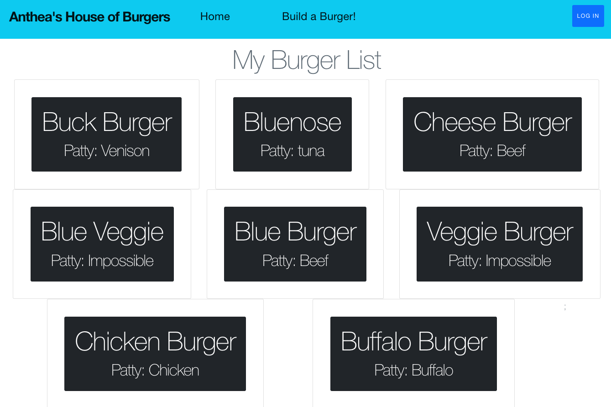
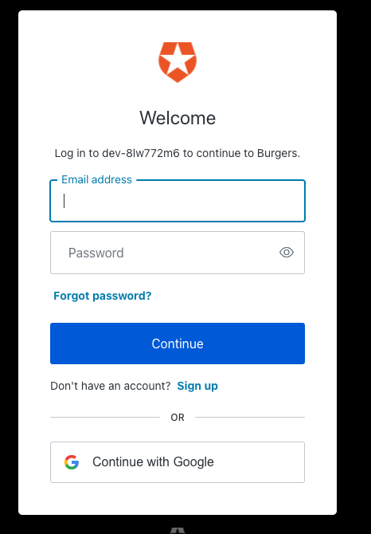
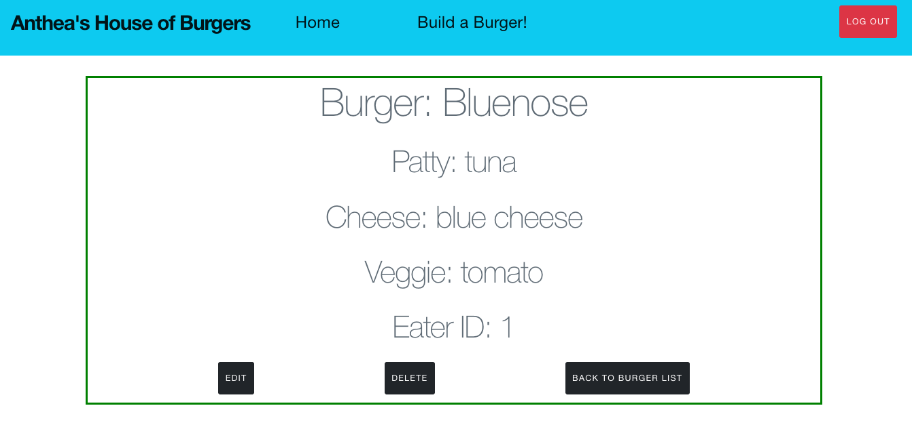
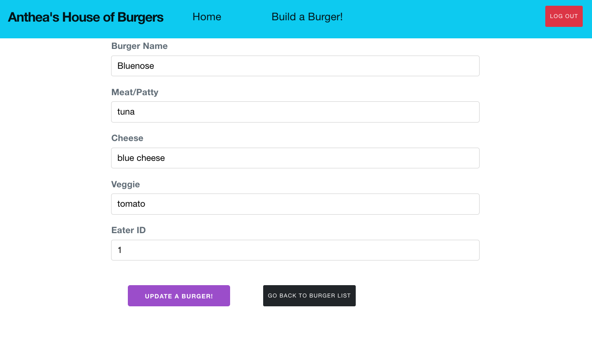

## Overview
Burgers is a full stack application using REACT, Bootstrap in the frontend; Ruby on Rails backend, Postgress database

## Technologies
Backend API: Ruby on Rails 
Database: Postgres 
CRUD Route Model: Burger 
Deployed on Heroku and Netlify 
Frontend Framework: React, Bootstrap 
Authorization: Auth0 

## Backend
 Backend language: Ruby 3.0.3 
 Postgres Database: Models "burger" and "user" 
 Heroku backend deployment: https://burger-be.herokuapp.com/burgers/ 
 github backend: https://github.com/aip956/Burger_BE 

## Frontend
 github frontend: https://github.com/aip956/Burger_Front 
 Netlify frontend deployment: https://burgersite-frontend.netlify.app/ 
 Frontend in REACT 
 Bootstrap styling 
 Model "burger" has full CRUD 
 Authentication: https://www.youtube.com/watch?v=1rgeO_EbSGg  
 Part 2: https://www.youtube.com/watch?v=NuCZgR09csE&list=PLZ14qQz3cfJL6aoKZ_Ly7jiYrwi9ihviW&index=3 
 
 Auth Blog: https://auth0.com/blog/complete-guide-to-react-user-authentication/ 
 Auth code: https://github.com/auth0-blog/auth0-react-sdk-video 

## Challenges
 Just scratched the surface of learning Bootstrap 

 Original project was using FaunaDB, then pivoted to GraphQL (query language and backend) and Apollo (on the FE to fetch and modify the data). Kept getting close but earlier in the week did not have full CRUD, so pivoted to learning Bootstrap. 

## Screenshots
### Index Page

### Auth0 Page
#### Need to log in to access editing, deleting, creating

### Individual Show Page

### Individual Edit Page

